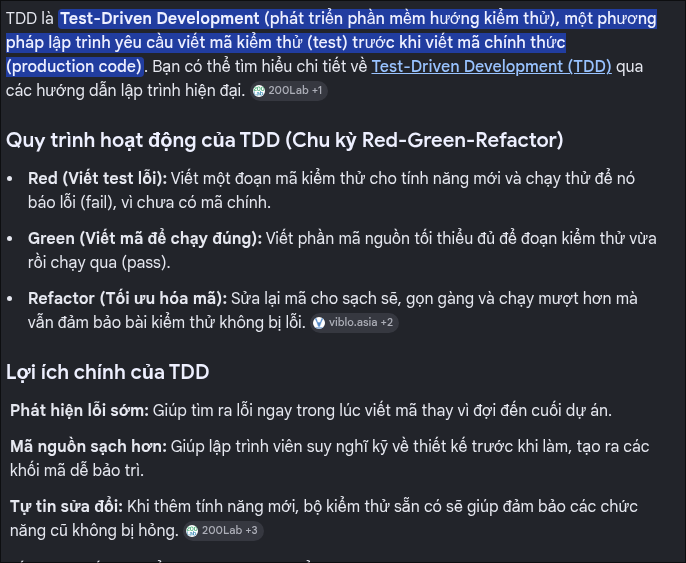

# Nghiên cứu Tuần 1: TDD cho Phát triển CLI với Sự hỗ trợ của AI

**Người thực hiện:** [Robert Nguyễn Minh Toàn]

> Điền đầy đủ từng phần bên dưới. Tài liệu này là deliverable của Tuần 1 — bám sát Acceptance Criteria trong [overview.md](./overview.md).

---

## 1. Nguyên lý cốt lõi của TDD

**TDD là gì?**

> Test-Driven Development (TDD) là một quy trình phát triển phần mềm trong đó các bài test tự động được viết **trước** khi viết mã sản phẩm thực tế (production code). Thay vì viết code rồi mới test, TDD đảo ngược quy trình này. Điều này mang lợi ích như là có thể có cái nhìn tổng quát về nghiệp vụ muốn xây dựng trước khi bắt đầu. Ví dụ moudle auth với social login google, lúc này bạn sẽ có cái nhìn tổng quan hơn ví dụ viết uni test , integration test và e2e.

**Red → Green → Refactor**

| Bước     | Chuyện gì xảy ra                                                                                                                                  | Vì sao quan trọng                                                                                                                                                                          |
| -------- | ------------------------------------------------------------------------------------------------------------------------------------------------- | ------------------------------------------------------------------------------------------------------------------------------------------------------------------------------------------ |
| Red      | Viết test cho một hành vi cụ thể chưa tồn tại và chạy để đảm bảo test **fail**. Ví dụ: `create` thiếu `title` phải báo lỗi và exit code khác `0`. | Buộc mình làm rõ yêu cầu và hành vi trước khi viết code. Test fail ở bước này chứng minh test không bị pass giả, tránh viết code sai hướng hoặc thừa logic.                                |
| Green    | Viết implementation **tối thiểu nhất** để test pass. Ví dụ: thêm validation `title` và trả về lỗi phù hợp.                                        | Giữ phạm vi nhỏ, có phản hồi nhanh, tránh over-engineering. Đặc biệt quan trọng khi dùng AI: chỉ nhận code vừa đủ để vượt qua test đã định nghĩa, không blindly accept code ngoài yêu cầu. |
| Refactor | Dọn dẹp và cải thiện cấu trúc code trong khi test vẫn xanh: tách hàm, đổi tên rõ hơn, giảm trùng lặp, chuẩn hóa error handling.                   | Giúp code dễ đọc, dễ maintain và an toàn khi thay đổi. Đây là bước biến code “chạy được” thành code “viết tốt”, nhất là sau khi review code do AI sinh ra.                                 |

---

## 2. Các cấp độ testing

| Cấp độ           | Định nghĩa                                                                                 | Bao phủ những gì                                                                       | Ví dụ trong Ticket Manager CLI                                                                                      | Tốc độ / Chi phí                                              |
| ---------------- | ------------------------------------------------------------------------------------------ | -------------------------------------------------------------------------------------- | ------------------------------------------------------------------------------------------------------------------- | ------------------------------------------------------------- |
| Unit test        | Test một đơn vị logic nhỏ, cô lập với file system, thời gian, process.                     | Logic thuần: parse argument, validate input, tạo ID, quy tắc chuyển trạng thái ticket. | `parseCreateCommand(['create', 'Fix bug'])` phải trả về `{ title: 'Fix bug', status: 'open' }`.                     | Rất nhanh, chi phí thấp, chạy được nhiều.                     |
| Integration test | Test sự phối hợp giữa nhiều module thông qua ranh giới thật hoặc giả lập nhẹ.              | Command handler + service + repository JSON; đảm bảo dữ liệu được lưu/đọc đúng.        | Sau khi gọi `createTicket`, file `tickets.json` phải chứa ticket mới và `listTickets` đọc lại được ticket đó.       | Nhanh đến trung bình, tốn hơn unit test một chút.             |
| End-to-end test  | Test CLI như người dùng thật: chạy lệnh, kiểm tra output, exit code và trạng thái lưu trữ. | Toàn bộ luồng: argv, stdout/stderr, exit code, file JSON.                              | Chạy `node cli.js create "Fix bug"` phải in thông báo thành công, exit code `0`, file `tickets.json` có ticket mới. | Chậm hơn, chi phí cao hơn, chỉ nên dùng cho luồng quan trọng. |

---

## 3. AI Validation: Test giúp xác thực code do AI sinh ra như thế nào

**Vì sao test quan trọng khi code do AI viết:**

> Test là đặc tả hành vi có thể chạy được. Khi dùng AI, test giúp mình xác nhận code thật sự đáp ứng yêu cầu thay vì chỉ “trông có vẻ đúng”. Test cũng buộc mình làm rõ input, output, edge case và hành vi lỗi trước khi để AI tạo implementation. Đây là hàng rào chống lại hallucination, giả định sai và việc copy-paste thiếu kiểm soát.

**Ví dụ cụ thể:**

- Code/function do AI sinh ra: AI viết hàm `updateTicketStatus(id, newStatus)` chỉ tìm ticket và gán trạng thái mới, không kiểm tra trạng thái hợp lệ, không xử lý file JSON bị hỏng.
- Test viết trước/sau: Viết test trước cho các hành vi:
  - Ticket không tồn tại phải báo lỗi rõ ràng và không ghi file.
  - Trạng thái không hợp lệ phải bị từ chối.
  - File JSON rỗng/hỏng phải được xử lý an toàn.
- Lỗi mà test phát hiện được: Test phát hiện AI cho phép chuyển trạng thái không hợp lệ và crash khi `tickets.json` rỗng. Sau đó yêu cầu AI thêm validation trạng thái, xử lý lỗi đọc file và trả về thông báo lỗi phù hợp.

---

## 4. Checklist test CLI — Ticket Manager CLI

| Khu vực      | Cần test gì                                                    | Ví dụ test case                                                                                                                                           |
| ------------ | -------------------------------------------------------------- | --------------------------------------------------------------------------------------------------------------------------------------------------------- |
| Commands     | `create`, `list`, `show`, `update` hoạt động đúng như mong đợi | `create "Fix bug"` tạo ticket với trạng thái `open`; `list --status open` chỉ trả về ticket đang mở; `show 123` hiển thị đúng ticket có id `123`.         |
| Validation   | Input không hợp lệ/thiếu bị từ chối kèm thông báo lỗi rõ ràng  | `create` thiếu title phải báo lỗi và exit code khác `0`; `update 123 --status invalid` phải từ chối và gợi ý trạng thái hợp lệ.                           |
| File storage | Đọc/ghi JSON, xử lý file bị hỏng/không tồn tại                 | Nếu `tickets.json` không tồn tại, CLI khởi tạo danh sách rỗng hoặc xử lý an toàn; nếu file chứa JSON hỏng, CLI không crash mà báo lỗi rõ ràng.            |
| Errors       | Ticket không tồn tại, chuyển trạng thái không hợp lệ, v.v.     | `show 999` báo “Ticket not found”; `update 123 --status done` thất bại nếu ticket không tồn tại; chuyển trạng thái sai quy tắc nghiệp vụ phải bị từ chối. |

---

## 5. Các lỗi thường gặp

| Lỗi                                                    | Vì sao là vấn đề                                                                                                                                                                       | Cách tránh                                                                                                                                                                            |
| ------------------------------------------------------ | -------------------------------------------------------------------------------------------------------------------------------------------------------------------------------------- | ------------------------------------------------------------------------------------------------------------------------------------------------------------------------------------- |
| Over-testing (test quá nhiều)                          | Tạo ra bộ test phình to, trùng lặp, chạy chậm nhưng không bảo vệ đúng hành vi quan trọng. Coverage cao không đồng nghĩa với phần mềm đúng.                                             | Chỉ test những hành vi có rủi ro cao và giá trị nghiệp vụ rõ ràng: commands, validation, file storage, error handling. Tự hỏi: “Nếu test này fail, người dùng có bị ảnh hưởng không?” |
| Weak assertions (assertion yếu)                        | Chỉ kiểm tra `defined`, `truthy`, “không crash” hoặc “có output” sẽ bỏ sót lỗi sai giá trị, sai trạng thái, sai thông báo lỗi, sai exit code.                                          | Assert cụ thể: đúng ticket được tạo, đúng trạng thái được lưu, đúng error message, đúng exit code, đúng nội dung file JSON. Test cả success path lẫn failure path.                    |
| Testing implementation details (test chi tiết cài đặt) | Test bám vào hàm nội bộ, số lần gọi private function hoặc cấu trúc dữ liệu nội bộ sẽ dễ fail khi refactor, dù hành vi bên ngoài vẫn đúng.                                              | Test thông qua hành vi công khai: input → output/side effect. Chỉ mock ở ranh giới ngoài như file system, time, process. Nếu dùng Hexagonal, mock adapters tại ports.                 |
| Blindly trusting AI output (tin AI mù quáng)           | AI có thể sinh code trông hợp lý nhưng sai logic, thiếu edge case, dùng API không tồn tại hoặc đưa ra giả định sai. Copy-paste không kiểm chứng làm mất khả năng kiểm soát chất lượng. | Xem AI như pair programmer. Đọc hiểu, hỏi assumptions, yêu cầu edge cases, chạy test, chạy CLI thật và refine. Nếu AI sai, chỉ ra lỗi sai và yêu cầu sửa dựa trên context đúng.       |

---

## 6. Bằng chứng áp dụng 3 workflow

Link NoteBookLM https://notebook.google.com/notebook/2a501d8a-26ee-4954-8030-53a65036e184 

### 6.1 Layered Questioning (Research → Brief → Example → Validation)

| Giai đoạn  | Bạn đã hỏi/làm gì                                                                                                                                                                                                                                                                                                                                                                                                                                           | Tóm tắt phản hồi của AI                                                                                                                                                                                                                                                                                                                                                                                                                       | Cách bạn kiểm chứng         |
| ---------- | ----------------------------------------------------------------------------------------------------------------------------------------------------------------------------------------------------------------------------------------------------------------------------------------------------------------------------------------------------------------------------------------------------------------------------------------------------------- | --------------------------------------------------------------------------------------------------------------------------------------------------------------------------------------------------------------------------------------------------------------------------------------------------------------------------------------------------------------------------------------------------------------------------------------------- | --------------------------- |
| Research   | Tìm hiểu nguyên lý cơ bản của TDD, mục đích và vai trò của nó trong quá trình phát triển phần mềm, các bước trong TDD loop (Red → Green → Refactor), các cấp độ test (unit, integration, end-to-end), và cách TDD áp dụng để validate code do AI sinh ra.                                                                                                                                                                                                   | AI giải thích TDD là vòng lặp "viết test trước → code vừa đủ pass → refactor". Red là viết test fail để định nghĩa hành vi mong đợi; Green là code tối thiểu để test pass; Refactor là cải thiện code khi test vẫn xanh. AI nhấn mạnh TDD giúp làm rõ yêu cầu, tránh code thừa, phát hiện edge case sớm và đặc biệt quan trọng khi validate code AI sinh ra. Kèm ví dụ CLI cụ thể: test `add ""` phải báo lỗi trước khi implement validation. |  |
| Brief      | AI liệt kê hành vi cần test theo 4 nhóm: (1) Commands — create/list/show/update phải tạo, hiển thị đúng dữ liệu, exit code 0; (2) Validation — từ chối title rỗng, status/priority không hợp lệ kèm error message rõ ràng, exit code ≠ 0; (3) File Storage — lưu/đọc/cập nhật tickets.json đúng, không mất dữ liệu; (4) Errors — xử lý ticket không tồn tại và file JSON hỏng mà không crash. Mỗi test case đều chỉ rõ input, expected output và exit code. |                                                                                                                                                                                                                                                                                                                                                                                                                                               |                             |
| Example    |                                                                                                                                                                                                                                                                                                                                                                                                                                                             |                                                                                                                                                                                                                                                                                                                                                                                                                                               |                             |
| Validation |                                                                                                                                                                                                                                                                                                                                                                                                                                                             |                                                                                                                                                                                                                                                                                                                                                                                                                                               |                             |

### 6.1 Layered Questioning (Research → Brief → Example → Validation)

| Giai đoạn  | Bạn đã hỏi/làm gì                                                                                                                                                             | Tóm tắt phản hồi của AI                                                                                                                                                                                                                                                                                                                                                                                                                        | Cách bạn kiểm chứng                                                                                                                                                                                                                                                                    |
| ---------- | ----------------------------------------------------------------------------------------------------------------------------------------------------------------------------- | ---------------------------------------------------------------------------------------------------------------------------------------------------------------------------------------------------------------------------------------------------------------------------------------------------------------------------------------------------------------------------------------------------------------------------------------------- | -------------------------------------------------------------------------------------------------------------------------------------------------------------------------------------------------------------------------------------------------------------------------------------- |
| Research   | Hỏi về TDD: TDD là gì, mục đích, chu trình Red → Green → Refactor, vì sao phải viết test trước khi viết code, và áp dụng vào CLI như thế nào.                                 | AI giải thích TDD là vòng lặp: viết test trước → viết code tối thiểu để pass → refactor khi test vẫn xanh. Red giúp định nghĩa hành vi mong đợi, Green giúp xác nhận hành vi đúng, Refactor giúp cải thiện code an toàn. AI nhấn mạnh TDD giúp làm rõ yêu cầu, tránh code thừa, phát hiện edge case sớm và đặc biệt hữu ích khi validate code do AI sinh ra. Ví dụ CLI: test `create` với title rỗng phải fail trước khi implement validation. | Kiểm chứng bằng cách trực tiếp search trên Google và các tài liệu chính thống                                                                                                                                                                               |
| Brief      | Đưa context cụ thể: Ticket Manager CLI gồm `create`, `list`, `show`, `update`, lưu dữ liệu trong `tickets.json`. Yêu cầu AI liệt kê các hành vi cần test trước khi implement. | AI chia test thành 4 nhóm: Commands, Validation, File Storage, Errors. Commands kiểm tra tạo/hiển thị/cập nhật ticket đúng dữ liệu và exit code 0. Validation kiểm tra title rỗng, status/priority không hợp lệ, phải báo lỗi rõ và exit code khác 0. File Storage kiểm tra đọc/ghi `tickets.json` đúng, không làm mất dữ liệu. Errors kiểm tra ticket không tồn tại và file JSON hỏng, CLI không crash.                                       | Không nhận danh sách AI đưa ra như checklist cuối cùng. Đối chiếu lại với yêu cầu đề bài, tự bổ sung case còn thiếu như file không tồn tại, exit code, output stderr, và ưu tiên test hành vi người dùng thật sự quan tâm.                                                             |
| Example    | Yêu cầu AI cho ví dụ Red-Green: viết unit test fail cho hành vi `createTicket` hợp lệ, sau đó viết implementation tối thiểu để test pass.                                     | AI đưa ra ví dụ với Vitest. **Red:** Viết test kỳ vọng hàm trả về object có `id`, `title`, `status: 'open'` và chạy để thấy test fail. **Green:** Viết implementation tối thiểu nhất chỉ return đúng object đó, AI cố tình liệt kê những thứ KHÔNG làm (không lưu file JSON, không tăng ID, không validate) để tránh làm thừa yêu cầu.                                                                                                         | Chạy thử test để đảm bảo nó fail ở bước Red. Review code Green để chắc chắn AI không "làm hộ" các phần ngoài yêu cầu. Tự nhận định: "Code Green này chưa dùng được cho production, nó chỉ đủ để qua test" -> hiểu rõ ranh giới của TDD.                                                |
| Validation | Hỏi AI các edge case cần test (input sai, ticket missing, file JSON hỏng) và cách kiểm chứng test không bị “pass giả”.                                                        | AI liệt kê edge case và nhấn mạnh cách chống "pass giả" bằng **Mutation Testing** (cố tình tiêm bug để xem test có fail không) và assert cả side-effect (so sánh nội dung file trước/sau, check exit code). AI khuyên dùng thư mục tạm (`mkdtempSync`) để test không ảnh hưởng file thật của dev.                                                                                                                                              | Áp dụng ngay Mutation Testing: chọn test "title rỗng", cố tình xóa dòng `if (!title)` trong code implementation. Test vẫn báo Xanh -> chứng tỏ assertion yếu (chỉ check hàm không crash mà không check file có bị ghi đè không). Phải viết lại test để assert cả side-effect lên file. |

### 6.2 Solution Exploration (Explore → Compare → Choose)

| Phương án cân nhắc | Ưu điểm | Nhược điểm | Có chọn không? | Vì sao (Tư duy đánh đổi) |
| ------------------ | ------- | ---------- | -------------- | ------------------------ |
| **Vitest** | - Native TS/ESM, zero-config. - Watch mode cực nhanh, phản hồi tức thì. - API `expect` mượt mà, mocking (`vi.mock`) linh hoạt. | - Thêm 1 dependency vào project. - Ecosystem trẻ và ít tài liệu cũ hơn Jest. | **Có** | **Tối ưu cho "Flow" của TDD.** Chấp nhận thêm 1 dependency để đổi lấy Developer Experience (DX) mượt mà. Giúp duy trì kỷ luật Red-Green-Refactor liên tục mà không bị đứt quãng vì chờ đợi hay ức chế khi fix config. |
| **Jest** | - Ecosystem khổng lồ, tài liệu phong phú. - Mocking cực mạnh, hỗ trợ snapshot testing. - Là chuẩn mực trong nhiều doanh nghiệp. | - Setup TS/ESM nhiều ma sát (`ts-jest`, flag thử nghiệm). - Tốc độ chậm hơn Vitest khi chạy TS/ESM. - Config nặng nề cho một CLI nhỏ. | Không | **Bẫy "Overkill".** Chọn công cụ vì nó *phổ biến nhất* thay vì *phù hợp nhất* sẽ tạo ra gánh nặng cấu hình không cần thiết. Với project nhỏ, việc dành thời gian fix config thay vì viết test là một sự đánh đổi sai. |
| **node:test** (Built-in) | - Zero-dependency, có sẵn trong Node. - Hỗ trợ ESM tự nhiên. - Tốc độ thực thi (execution) rất nhanh. | - Chạy TS cần thêm loader (`tsx`). - Assertion (`assert`) cứng nhắc, kém mượt. - Mocking `fs` phức tạp, watch mode chưa hoàn thiện. | Không | **Bẫy "Zero-dependency".** Tiết kiệm 1 dependency nhưng trả giá bằng DX tệ. TDD đòi hỏi phải viết và chạy hàng trăm test, assertion rườm rà và mocking khó khăn sẽ giết chết động lực và làm chậm tốc độ phản hồi. |

### 6.3 Iterative Refinement (Review → Summarize → Refine → Feedback → Validate)

| Vòng | AI đề xuất gì | Bạn review thế nào | Yêu cầu tinh chỉnh gì | Kết quả sau tinh chỉnh |
| ---- | ------------- | ------------------ | --------------------- | ---------------------- |
| 1    |               |                    |                       |                        |
| 2    |               |                    |                       |                        |

---

## 7. Tự kiểm tra theo Acceptance Criteria

Copy từ [overview.md](./overview.md) — xác nhận từng mục trước khi nộp:

- [x] Nội dung nghiên cứu đầy đủ: nguyên lý TDD, các cấp độ test, ví dụ test CLI, AI validation
- [x] Quá trình nghiên cứu với AI được ghi lại: đã áp dụng workflow và ghi rõ các vòng lặp (Mục 6 hoàn chỉnh)
- [x] Có thể trình bày rõ ràng kết quả nghiên cứu khi nộp bài
- [x] Có thể trả lời câu hỏi về TDD, các loại test, và validate code AI dựa trên nghiên cứu này

## 8. Chuẩn bị Q&A

Dự đoán các câu hỏi có thể gặp khi trình bày nghiên cứu này, và chuẩn bị sẵn câu trả lời ngắn gọn.

| Câu hỏi có thể gặp                                                                               | Câu trả lời của bạn |
| ------------------------------------------------------------------------------------------------ | ------------------- |
| Sự khác biệt giữa unit test và integration test là gì?                                           |                     |
| Vì sao viết test trước khi viết implementation?                                                  |                     |
| Làm sao biết một implementation do AI sinh ra là "hoàn thành"?                                   |                     |
| Vấn đề của việc test chi tiết cài đặt (implementation details) thay vì hành vi (behavior) là gì? |                     |
